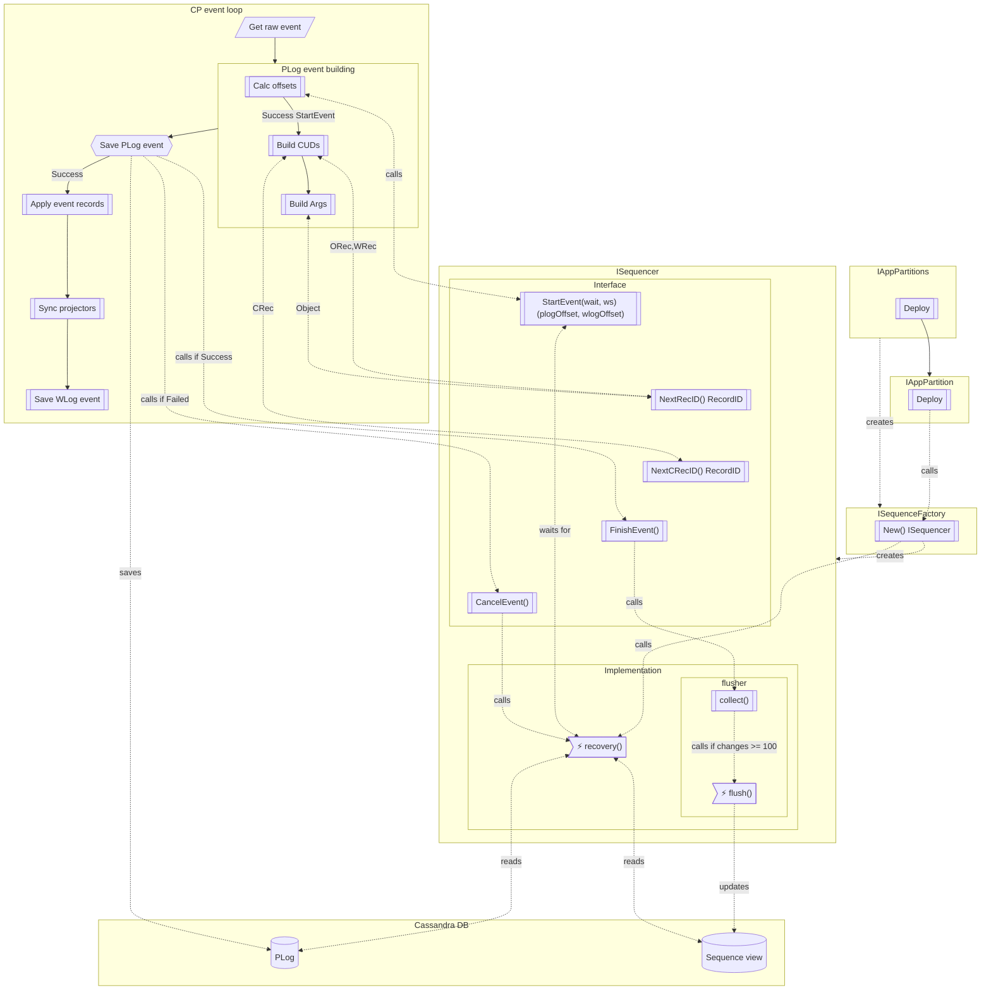

# Sequences

Sequence is a monotonic increasing list of numbers.

## Motivation

- [Sequences #3215](https://github.com/voedger/voedger/issues/3215)

## Requirements

QName for sequence view is defined in `appdef/sys`:

- `sys.SequencesView`

QNames for sequences are defined in `appdef/sys`:

- `sys.PLogOffsetSeq`
- `sys.WLogOffsetSeq`
- `sys.appdef.RecIDSeq`
- `sys.appdef.CRecIDSeq`

Field names for sequences view are defined in `appdef/sys`:

- `SequencesView_PID`
- `SequencesView_WSID`
- `SequencesView_Name`
- `SequencesView_Last`

To access sequences `ISequencer` interface is used.
`ISequencer` defined in `sequences` package.
`ISequencer` implemented by `Sequencer` struct. `Sequencer` struct is defined in `sequences/sequencer` package.

## Components

- `pkg/sequence`
  - `ISequenceFactory`
  - `ISequencer`
  - `NewFactory(istructs.IAppStructs) ISequenceFactory`
- `pkg/sequences/sequencer`
  - `Sequencer` supports `sequences.ISequencer`
- `pkg/appparts`
  - `IAppPartition.Sequencer() ISequencer`

## Interface `ISequenceFactory`

### `sequence.NewFactory(str istructs.IAppStructs) ISequenceFactory`

- Actor: `appparts.IAppPartitions`
- When: application is deployed
- Flow:
  - Create a new `sequenceFactory` instance with `newSequenceFactory(str)`

### `ISequenceFactory.New(pid istructs.PartitionID) (ISequencer, cleanup func())`

- Actor: `appparts.IAppPartition`
- When: app partition is deployed
- Flow:
  - Create new cancelable context `ctx` with `context.Background()`
  - Create a new `sequencer` instance with `newSequencer(ctx, pid, str)`
  - Call `sequencer.recovery()`
  - Return `sequencer` and `cleanup` function, which cancels `ctx` and calls `sequencer.wait()`

## Interface `ISequence`

- `StartEvent(wait time.Duration, ws istructs.WSID) (plogOffset, wlogOffset istructs.Offset)`
  - Actor: CP
  - When: CP needs to process a request
- `NextRecID() istructs.RecordID`
  - Actor: CP
  - When: CP needs the next ODoc/ORecord or WDoc/WRecord ID
- `NextCRecID() istructs.RecordID`
  - Actor: CP
  - When: CP needs the next CDoc/CRecord ID
- `FinishEvent()`
  - Actor: CP
  - When: CP stores PLogEvent record
- `CancelEvent()`
  - Actor: CP
  - When: CP fail with PLogEvent record
- `Status() SequenceStatus`
  - Should be concurency safe

## Enumeration `SequenceStatus`

- `None` (iota)
- `Recover`
- `Ready`
- `Eventing`
- `Finished`

## Flow control schema

## Implementation `Sequencer`

### `Sequencer`

- Should supports `ISequencer` interface
- Fields:
  - `ctx context.Context`
  - `pid istructs.PartitionID`
  - `str istructs.IAppStructs`
  - `status atomic.Uint32`
  - `flusher flusher`
  - `plogOffset istructs.Offset`
  - `ws istructs.WSID`
  - `wlogOffset map[istructs.WSID]istructs.Offset`
  - `recID map[istructs.WSID]istructs.RecordID`
  - `cRecID map[istructs.WSID]istructs.RecordID`
- Methods:
  - `recovery()`
  - `wait()`

### `newSequencer(ctx context.Context, pid istructs.PartitionID, str istructs.IAppStructs)`

- Create a new `Sequencer` instance
- Set `Sequencer.ctx`, `Sequencer.pid` and `Sequencer.str` fields
- Create `Sequencer.flusher` instance with `newFlusher(ctx, pid, str)`

### `Sequencer.StartEvent(wait time.Duration, ws istructs.WSID) (plogOffset, wlogOffset istructs.Offset)`

- Switch on `Sequencer.Status()`:
  - case `Recover`:
    - Wait for `Sequencer.Status()` is `Ready` during `wait` duration expired or `Sequencer.ctx` is done
      - If ok (`Sequencer.Status()` is `Ready`), then fall through to `Ready`
      - else return (`istructs.NullOffset`, `istructs.NullOffset`)
  - case `Ready`:
    - Set `Sequencer.status` to `Eventing`
    - Set `Sequencer.ws` to `ws`
    - Increment `Sequencer.plogOffset` and `Sequencer.wlogOffset[ws]` counters
    - Return (`Sequencer.plogOffset, Sequencer.wlogOffset[ws]`)
  - else panic

### `Sequencer.NextRecID() istructs.RecordID`

- Check `Sequencer.Status()` is `Eventing`. If not, panic
- Increment `Sequencer.recID[Sequencer.ws]` counter
- Return `Sequencer.recID[Sequencer.ws]`

### `Sequencer.NextCRecID() istructs.RecordID`

- Check `Sequencer.Status()` is `Eventing`. If not, panic
- Increment `Sequencer.cRecID[Sequencer.ws]` counter
- Return `Sequencer.cRecID[Sequencer.ws]`

### `Sequencer.FinishEvent()`

- Check `Sequencer.Status()` is `Eventing`. If not, panic
- Call `flusher.collect(plogOffset, ws, wlogOffset[ws], recID[ws], cRecID[ws])`
- Set `Sequencer.status` to `Ready`

### `Sequencer.CancelEvent()`

- Check `Sequencer.Status()` is `Eventing`. If not, panic
- Call `Sequencer.recovery()`

### `Sequencer.Status() SequenceStatus`

- Return `Sequencer.status` value

### `Sequencer.recovery()`

- Check `Sequencer.Status()` is `None` or `Eventing`, panic if not
- Set `Sequencer.status` to `Recover`
- Starts go routine, which:
  - Recover cycle, repeatable:
    - while `flusher.active` wait for `flusher.active` is `false` or `Sequencer.ctx` done
    - Clear `Sequencer.plogOffset`, `Sequencer.wlogOffset`, `Sequencer.recID` and `Sequencer.cRecID` maps
    - Read system view `str.ViewRecords().Read(Sequencer.ctx, sys.Sequences, …)` with PK `pid`, for each `vr` record:
      - `ws := vr.AsInt64(sys.SequencesView_WSID)`
      - switch `vr.AsQName("Seq")` value:
        - case `sys.PLogOffsetSeq`:
          - `Sequencer.plogOffset = vr.AsInt64(sys.SequencesView_Last)`
        - case `sys.WLogOffsetSeq`:
          - `Sequencer.wlogOffset[ws] = vr.AsInt64(sys.SequencesView_Last)`
        - case `sys.RecIDSeq`:
          - `Sequencer.recID[ws] = vr.AsInt64(sys.SequencesView_Last)`
        - case `sys.CRecIDSeq`:
          - `Sequencer.cRecID[ws] = vr.AsInt64(sys.SequencesView_Last)`
    - Read PLog records `str.Events().ReadPLog(Sequencer.ctx, Sequencer.pid, Sequencer.plogOffset, istructs.ReadToTheEnd, …)` from `plogOffset` to the end, for each `event`:
      - `ws := event.WSID()`
      - For each `event.CUDs()` entry, if `cud.IsNew()`:
        - switch `appdef.Type(cud.QName()).Kind()`:
          - case `appdef.TypeKind_CDoc`, `appdef.TypeKind_CRecord`:
            - set `cRecID[ws]` to `cud.ID().BaseRecordID()` if `BaseRecordID` is greater than `cRecID[ws]`
          - case `appdef.TypeKind_ODoc`, `appdef.TypeKind_ORecord`, `appdef.TypeKind_WDoc`, `appdef.TypeKind_WRecord`:
            - set `RecID[ws]` to `cud.ID().BaseRecordID()` if `BaseRecordID` is greater than `RecID[ws]`
      - For `obj` from `event.Argument()` with children recursively:
        - set `RecID[ws]` to `obj.ID().BaseRecordID()` if `BaseRecordID` is greater than `RecID[ws]`
  - If error occurs and `Sequencer.ctx` is not done, then repeat recovery cycle
  - Set `Sequencer.Status()` to `Ready`

### `Sequencer.wait()`

- If `Sequencer.Status()` is `Recovery` then
  - wait for `Sequencer.Status()` is `Ready`
- else
  - If `flusher.changes` is not `nil` then call `flusher.flush()`
  - Wait for `flusher.active` is `false`
- Sets `Sequencer.Status()` to `Finished`

### `flusher`

- Fields:
  - `ctx context.Context`
  - `pid istructs.PartitionID`
  - `str istructs.IAppStructs`
  - `active atomic.Bool`
  - `changes *changes`
  - `channel chan *changes`
  - `keys sync.Pool` of `istructs.IKeyBuilder`
    - Initialized to `sync.Pool{New: func() interface{} { return str.ViewRecords().NewKeyBuilder(sys.SequencesView) }}`
  - `values sync.Pool` of `istructs.IValueBuilder`
    - Initialized to `sync.Pool{New: func() interface{} { return str.ViewRecords().NewValueBuilder(sy.SequencesView) }}`
- Methods:
  - `collect(plogOffset istructs.Offset, ws istructs.WSID, wlogOffset istructs.Offset, recID, cRecID istructs.RecordID)`
  - `flush()`
  - `putBatch()`
  - `key(ws istructs.WSID, seq appdef.QName) istructs.IKeyBuilder`
  - `value(last uint64) istructs.IValueBuilder`
- Consts:
  - `flushChangesCount = 100`

### `newFlusher(ctx context.Context, pid istructs.PartitionID, str istructs.IAppStructs)`

- Create a new `flusher` instance
- Set `flusher.ctx`, `flusher.pid` and `flusher.str` fields

### `flusher.collect(plogOffset istructs.Offset, ws istructs.WSID, wlogOffset istructs.Offset, recID, cRecID istructs.RecordID)`

- If `flusher.changes` is `nil`, then:
  - Create a new `changes` instance
- `flusher.changes.plogOffset = plogOffset`
- `flusher.changes.wlogOffset[ws] = wlogOffset`
- `flusher.changes.recID[ws] = recID`
- `flusher.changes.cRecID[ws] = cRecID`
- `flusher.changes.count++`
- If not `flusher.active` and  `changes.count >= flushChangesCount`:
  - call `flusher.flush()`

## `flusher.flush()`

- Set `flusher.active` to `true`
- `flusher.channel <- changes`
- `changes = nil`
- Call `go flusher.putBatch()`

### `flusher.putBatch()`

- `changes = <-flusher.channel`
- `batchSize = len(changes.wlogOffset) * 3 + 1`
- `batch = make([]istructs.ViewKV, 0, batchSize)`
- for each `ws` in `changes.wlogOffset`:
  - append to `batch` new `istructs.ViewKV{}`:
    - `Key`: `flusher.key(ws, sys.WlogOffsetSeq)`
    - `Value`: `flusher.value(changes.wlogOffset[ws])`
  - if exists `changes.recID[ws]`, then:
    - append to `batch` new `istructs.ViewKV{}`:
      - `Key`: `flusher.key(ws, sys.RecIDSeq)`
      - `Value`: `flusher.value(changes.recID[ws])`
  - if exists `changes.cRecID[ws]`, then:
    - append to `batch` new `istructs.ViewKV{}`:
      - `Key`: `flusher.key(ws, sys.CRecIDSeq)`
      - `Value`: `flusher.value(changes.cRecID[ws])`
- append to `batch` new `istructs.ViewKV{}`:
  - `Key`: `flusher.key(istructs.NullWSID, sys.PlogOffsetSeq)`
  - `Value`: `flusher.value(changes.plogOffset)`
- repeat `str.ViewRecords().PutBatch(istructs.NullWSID, batch)` until success or context `flusher.ctx` done
- Set `flusher.active` to `false`

### `flusher.key(ws istructs.WSID, seq appdef.QName) istructs.IKeyBuilder`

- `key = flusher.keys.Get().(istructs.IKeyBuilder)`
- `key.PutInt64(sys.SequencesView_PID, int64(flusher.pid))`
- `key.PutInt64(sys.SequencesView_WSID, int64(ws))`
- `key.PutQName(sys.SequencesView_Name, seq)`
- return `key`

### `flusher.value(last uint64) istructs.IValueBuilder`

- `value = flusher.values.Get().(istructs.IValueBuilder)`
- `value.PutInt64(sys.SequencesView_Last, int64(last))`
- return `value`

### `changes` struct

- Fields:
  - `plogOffset istructs.Offset`
  - `wlogOffset map[istructs.WSID]istructs.Offset`
  - `recID map[istructs.WSID]istructs.RecordID`
  - `cRecID map[istructs.WSID]istructs.RecordID`
  - `count uint64`
